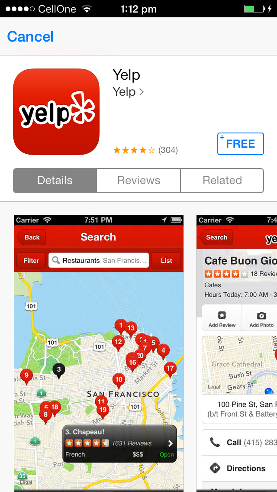

TiStoreView
===========================================

TiStoreView enables you to show your app or any other app, who's App ID you know, from within your app.



TEST HARNESS EXAMPLE FOR YOUR MODULE
------------------------------------

The `example` directory contains a skeleton application test harness that can be 
used that shows how to use the app.

The appID is obtained from iTunes Connect (for your own apps), or can be looked up by the itunes search & lookup APIs.


INSTALL YOUR MODULE
--------------------

1. Run `build.py` which creates your distribution
2. cd to `/Library/Application Support/Titanium`
3. copy this zip file into the folder of your Titanium SDK

REGISTER YOUR MODULE
---------------------

Register your module with your application by editing `tiapp.xml` and adding your module.
Example:
```xml
<modules>
    <module version="1.1.0">com.dezinezync.storeview</module>
</modules>
```

When you run your project, the compiler will know automatically compile in your module
dependencies and copy appropriate image assets into the application.

USING YOUR MODULE IN CODE
-------------------------

To use your module in code, you will need to require it. 

### Example
```js
var TiStoreView = require('com.dezinezync.storeview');
TiStoreView.showProductDialog({
    'id': '**********', // SKStoreProductParameterITunesItemIdentifier
    'ct': '', // SKStoreProductParameterCampaignToken
    'pt': '', // SKStoreProductParameterProviderToken
    'at':'', // SKStoreProductParameterAffiliateToken
    'advp': '' // SKStoreProductParameterAdvertisingPartnerToken
});
```

### Events
```js
// Notifies when data is being loaded over the network
TiStoreView.addEventListener('loading', callback)
	
// Notifies when the modal is ready to be shown
TiStoreView.addEventListener('willshow', callback)
	
// Notifies when the modal is ready to be dismissed (user action: Cancel button or such)
TiStoreView.addEventListener('willdismiss', callback)
	
// Notifies when an error has occurred.
TiStoreView.addEventListener('error', callback)
```

The example app uses Yelp's app ID for proof-of-concept purposes.

LICENSE
-------
Please refer to the LICENSE file included with this project for the License details.

DISCLAIMER
----------
I am in no way associated with, currently or previously have been engaged with Yelp or any of their partners, employees, etc. I've used Yelp's app's ID just to show how the module works.


Cheers!
